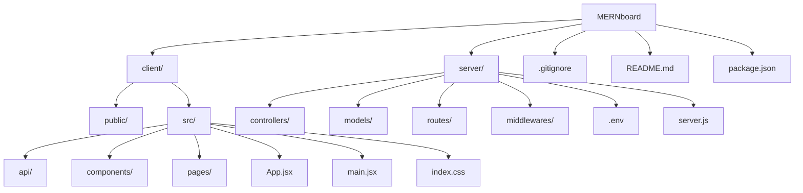

# 📝 MERNboard

MERNboard is a full-stack web application for simple note-taking. Built using the **MERN** stack (MongoDB, Express.js, React, Node.js), it allows users to **create**, **read**, **update**, and **delete** notes with a clean, modern interface.

---

## 🌐 Live Demo

🚀 Coming Soon\
*(Deploy it on *[*Vercel*](https://vercel.com)*, *[*Render*](https://render.com)*, or *[*Railway*](https://railway.app)* and update this section)*

---

## ✨ Features

- ✅ **Create, Read, Update, Delete (CRUD)** notes
- 🧠 **MERN Stack** (MongoDB, Express.js, React + Vite, Node.js)
- 🚦 **API Rate Limiting** with Upstash Redis (100 req/min/user)
- 🎨 **Modern UI** with Tailwind CSS + DaisyUI
- ⚡ **Instant Feedback** using react-hot-toast
- 🔀 **Client-side Routing** with React Router
- 🔐 **Custom Middleware** (rate limiter)
- 🔄 **Reusable Components**: Navbar, NoteCard, etc.

---

## 🏗️ Tech Stack

### 🔹 Frontend

- React (via Vite)
- Tailwind CSS + DaisyUI
- Axios
- React Router DOM
- React Hot Toast
- Lucide React

### 🔸 Backend

- Node.js + Express.js
- MongoDB (with Mongoose)
- RESTful API (`/api/notes`)
- Upstash Redis (for rate limiting)
- CORS middleware

---

## 🧱 Folder Structure (Mermaid)



---

## 🛍️ User Flow

### 1. View Notes

- GET `/api/notes` → fetch and display all notes

### 2. Create Note

- POST `/api/notes` → user inputs title & content, then saves

### 3. View/Edit Note

- GET `/api/notes/:id` → fetch single note
- PUT `/api/notes/:id` → update note fields

### 4. Delete Note

- DELETE `/api/notes/:id` → removes selected note

All routes are protected by a custom **rate limiter**.

---

## 🚦 API Rate Limiting

- **Service:** [Upstash Redis](https://upstash.com/)
- **Strategy:** Sliding window algorithm
- **Limits:** 100 requests / 60 seconds / IP or user key
- **Custom Middleware:** Blocks excessive requests with `429 Too Many Requests`

---

## ⚙️ Backend Flow: Create Note

1. Request hits `POST /api/notes`
2. Middleware: `cors`, `express.json()`, `rateLimiter`
3. Controller `addNote` extracts `title` & `content` from `req.body`
4. Mongoose saves a new `Note` to MongoDB
5. Server responds with success (`201`) or error (`500`)

---

## 🚀 Getting Started

### 🔧 Prerequisites

- Node.js & npm
- MongoDB URI (e.g., MongoDB Atlas)
- Upstash Redis credentials

### 📅 Installation

```bash
# Clone the project
git clone https://github.com/Adytia855/MERNboard.git
cd MERNboard

# Install backend dependencies
cd server
npm install

# Install frontend dependencies
cd ../client
npm install
```

### 🛠️ Running Locally

```bash
# Start the backend server
cd server
npm run dev

# Start the frontend dev server
cd ../client
npm run dev
```

Create a `.env` file in `server/`:

```env
PORT=5000
MONGO_URI=your_mongodb_uri_here
UPSTASH_REDIS_REST_URL=your_upstash_url_here
UPSTASH_REDIS_REST_TOKEN=your_upstash_token_here
```

---

## 📸 Screenshots

> Add screenshots or GIFs here to showcase the app.

---

## 📜 License

MIT License © 2025 [Adytia855](https://github.com/Adytia855)

---

## 🔗 Related Projects

- [🔗 My Portfolio](https://github.com/Adytia855/Portfolio)
- [🌍 Deployed Site (soon)](https://your-deployment-link)

---

## 🙌 Acknowledgements

- Tailwind CSS
- DaisyUI
- React Hot Toast
- Lucide Icons
- Upstash

---

> *“Built with love and learning by Adytia.”*

